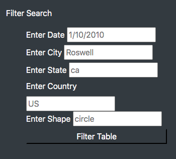
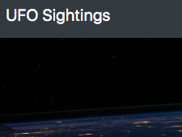

# UFOs

## Overview of the Analysis
The purpose of this assignment was to create a website that displays UFO sightings that have been reported. Using html, javascript, css, and bootstrap, we were able to create this website. We also had to create a way for people on the website to filter through the data.

## Results
* When you go to the website, you will see this section to allow you to filter the data. As you can see, you are able to filter through date, city, state, country, and shape. You are also able to filter multiple sections at once.

* To reset the table, you can click on "UFO Sightings" at the top left of the website.
	
	
	
	
## Summary 
* One drawback with the new design is there is not a filter for duration. 
* one reccomendation I have would be to allow a duration filter to list time frames of the encounters.
* Another suggestion I have would be to add more data. If there was more data, it would be interesting to see if there's a certain trends in the sightings.
